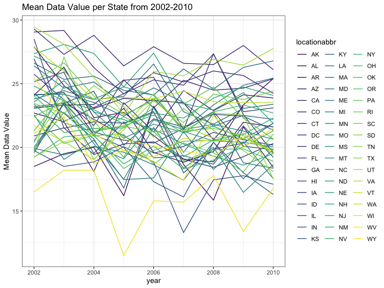
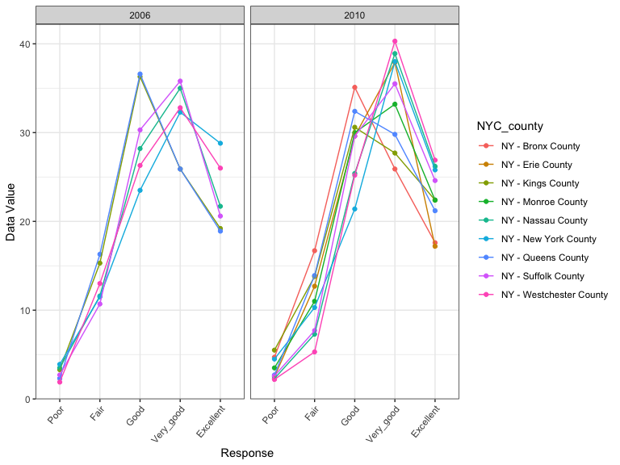
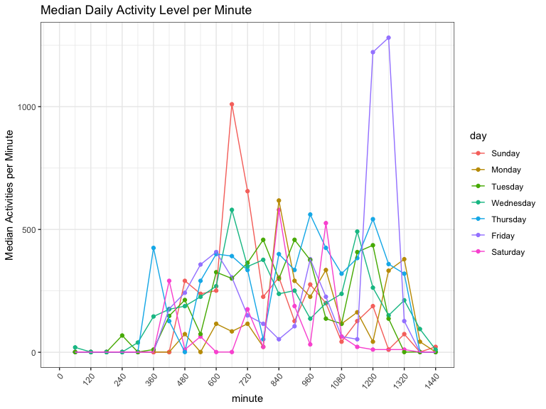

P8105 - Homework 3
================
Molly Martorella
10/12/2019

# Problem 1

The Instacart data from 2017 has **1384617** orders, and it describes
these orders with **15** variables, some of which are: *order\_id*,
*product\_id*, *product\_name*, whether it was *reordered*, and the
*department\_id* and *aisle*. There are 134 aisles, and the fresh
vegetable and fresh fruit aisles are ordered from the most.

## Plot of Most Popular Aisles

``` r
instacart %>% 
  count(aisle, sort = TRUE) %>% 
  filter(n > 10000) %>% 
  ggplot(aes(x = reorder(aisle, -n), y = n)) +
  geom_col() +
  ggtitle("Number of Instacart Orders by Aisle") +
  xlab("Aisle") +
  ylab("Number of Items Ordered") +
  theme(axis.text.x = element_text(angle = 60, 
                                   hjust = 1))
```


## Three most popular items from select aisles

The number of times the three most popular items in each of the aisles
“baking ingredients”, “dog food care”, and “packaged vegetables
fruits” are ordered is presented in the following table:

``` r
instacart %>% 
  filter(aisle %in% c("baking ingredients", 
                    "dog food care", 
                    "packaged vegetables fruits")) %>% 
  group_by(aisle) %>% 
  count(product_name, sort = TRUE) %>% 
  filter(min_rank(desc(n)) <= 3) %>% 
  pivot_wider(names_from = aisle,
              values_from = n) %>% 
  knitr::kable()
```

| product\_name                                 | packaged vegetables fruits | baking ingredients | dog food care |
| :-------------------------------------------- | -------------------------: | -----------------: | ------------: |
| Organic Baby Spinach                          |                       9784 |                    |               |
| Organic Raspberries                           |                       5546 |                    |               |
| Organic Blueberries                           |                       4966 |                    |               |
| Light Brown Sugar                             |                            |                499 |               |
| Pure Baking Soda                              |                            |                387 |               |
| Cane Sugar                                    |                            |                336 |               |
| Snack Sticks Chicken & Rice Recipe Dog Treats |                            |                    |            30 |
| Organix Chicken & Brown Rice Recipe           |                            |                    |            28 |
| Small Dog Biscuits                            |                            |                    |            26 |

## Ordering Day/Time of Pink Lady Apples vs Coffee Ice Cream

The following is a table showing the mean hour of the day per each day
of the week that Pink Lady Apples and Coffee Ice Cream are ordered.

``` r
instacart %>% 
  filter(product_name %in% c("Pink Lady Apples",
                           "Coffee Ice Cream")) %>% 
  group_by(product_name, order_dow) %>% 
  mutate(mean_hour = mean(order_hour_of_day)) %>% 
  select(c(product_name, 
           order_dow, 
           mean_hour)) %>%
  distinct() %>% 
  pivot_wider(names_from = order_dow, 
              values_from = mean_hour) %>% 
  rename(Monday = '0',
         Tuesday = '1',
         Wednesday = '2',
         Thursday = '3',
         Friday = '4',
         Saturday = '5',
         Sunday = '6') %>%
  select(product_name, 
         Monday, 
         Tuesday, 
         Wednesday, 
         Thursday, 
         Friday, 
         Saturday, 
         Sunday) %>% 
  knitr::kable(digits = 1)
```

| product\_name    | Monday | Tuesday | Wednesday | Thursday | Friday | Saturday | Sunday |
| :--------------- | -----: | ------: | --------: | -------: | -----: | -------: | -----: |
| Pink Lady Apples |   13.4 |    11.4 |      11.7 |     14.2 |   11.6 |     12.8 |   11.9 |
| Coffee Ice Cream |   13.8 |    14.3 |      15.4 |     15.3 |   15.2 |     12.3 |   13.8 |

# Problem 2

Cleaning the data:

``` r
data("brfss_smart2010")

brfss_smart2010 <-
  brfss_smart2010 %>%
  janitor::clean_names() %>%
  filter(topic == "Overall Health") %>% 
  mutate(response = recode(response, "Very good" = "Very_good"),
         response = factor(response, 
                           levels = c("Poor", 
                                      "Fair", 
                                      "Good", 
                                      "Very_good", 
                                      "Excellent")))
```

# Q1

In 2002, which states were observed at 7 or more locations? What about
in 2010?

``` r
brfss_smart2010 %>% 
  filter(year %in% c(2002, 2010)) %>% 
  select(year,
         locationabbr,
         locationdesc,
         geo_location) %>% 
  distinct() %>%
  group_by(locationabbr, 
           year) %>% 
  count() %>% 
  filter(n > 7) %>% 
  pivot_wider(names_from = year, 
              values_from = n) %>% 
  knitr::kable()  
```

| locationabbr | 2010 | 2002 |
| :----------- | ---: | ---: |
| CA           |   12 |      |
| FL           |   41 |      |
| MA           |    9 |    8 |
| MD           |   12 |      |
| NC           |   12 |      |
| NE           |   10 |      |
| NJ           |   19 |    8 |
| NY           |    9 |      |
| OH           |    8 |      |
| PA           |      |   10 |
| TX           |   16 |      |
| WA           |   10 |      |

In 2002, only MA, NJ, and PA had 7 or more locations where observations
were made for the study. In 2010 the number of states with more than 7
observations increased to 12 total states, including: CA, FL, MA, MD,
NC, NE, NJ, NY, OH, TX, and WA. Interestingly, despite having more than
7 locations in 2002, PA had fewer than 7 locations in 2010.

# Q2

Mean data value of excellent responses from each state over the years
2002-2010:

``` r
brfss_smart2010 %>%
  filter(response == "Excellent") %>%
  select(year, 
         locationabbr, 
         response, 
         data_value) %>%
  group_by(year, 
           locationabbr) %>% 
  summarise(state_mean = mean(data_value, na.rm = TRUE)) %>% 
  ggplot(aes(x = year, 
             y = state_mean, 
             color = locationabbr)) +
  geom_line() +
  ggtitle("Mean Data Value per State from 2002-2010") +
  ylab("Mean Data Value") +
  scale_color_discrete()
```



Of all the states, West Virginia has the lowest prevalence of
“Excellent” responses. This likely reflects reduced access to
hospitals due to how rural and impoverished communities in West Virginia
are, and this would result in both worse health outcomes as well as
lower overall enrollment in research studies.

Overall, the data appears to be downward trending, but it is likely this
is due to the increased amount of data available from more locations in
the 2010 data set compared to 2002. It is possible the values are
approaching the true population mean, but this would have to be
investigated more closely on a state by state level across all response
groups and accounting for differences in sample size.

# Q3

Plot showing the distribution of data\_value for responses (“Poor” to
“Excellent”) among locations in NY State for the years 2006 and 2010.

``` r
brfss_smart2010 %>% 
  filter(locationabbr == "NY",
         year %in% c(2006, 2010)) %>% 
  select(year, 
         locationabbr,
         locationdesc,
         response, 
         data_value) %>% 
  mutate(NYC_county = locationdesc) %>% 
  ggplot(aes(x = response, 
             y = data_value, 
             color = NYC_county, 
             group = NYC_county)) +
  geom_point() +
  geom_line() +
  theme(axis.text.x = element_text(angle = 50, 
                                   hjust = 1)) +
  xlab("Response") +
  ylab("Data Value") +
  facet_grid(~year)
```



The Bronx, Queens, and King county all appear to have more “Good”
responses and fewer “Very Good” and “Excellent” responses. This is
again, likely a reflection of impoverished communities and communities
with higher immigrant populations and thus lower access to regular
health care evaluations and ability to pay for treatments. This is
supported by the fact that Westchester County and New York County
consistently have the highest number of “Very Good” and “Excellent”
responses. (Googling median income in Westchester and New York counties
shows ~85-90k, whereas Bronx County is ~35k).

## Problem 3

Cleaning the data:

``` r
activity <- read_csv(file = "data/accel_data.csv") %>% 
  janitor::clean_names() %>% 
  pivot_longer(cols = activity_1:activity_1440, 
               names_to = "minute", 
               values_to = "activities") 
```

    ## Parsed with column specification:
    ## cols(
    ##   .default = col_double(),
    ##   day = col_character()
    ## )

    ## See spec(...) for full column specifications.

``` r
activity <- 
  activity %>% 
  mutate(minute = gsub("activity_", 
                       "", 
                       pull(activity, minute)),
         activities = as.numeric(activities),
         day = factor(day, levels = c("Sunday",
                                      "Monday", 
                                      "Tuesday", 
                                      "Wednesday", 
                                      "Thursday", 
                                      "Friday",
                                      "Saturday")),
         weekday = as.character(day %in% c("Monday", 
                                           "Tuesday", 
                                           "Wednesday", 
                                           "Thursday", 
                                           "Friday")),
         weekday = recode(weekday, 
                          "TRUE" = "weekday", 
                          "FALSE" = "weekend")) %>% 
  select(week, day_id, day, weekday, everything())
```

The final data set, *activity*, contains 5 weeks of accelerometer data
from a 65 year old male with a bmi of 25. Variables include week (values
1-5), day\_id (values 1-35), the day of the week, whether it’s a weekend
or weekday, the minute of the day the activity level was recorded
(values 1-1440), and the number of activities recorded in that minute.
It contains 50400 observations of 6 variables.

## Q1

The following are tables of the total activities recorded per each day
of the study as well as the overall total for each day of the week.

From the first table, it is difficult to discern trends, however, it
appears Saturday, Sunday, and Monday are days of low activity. The
second table confirms that the weekend, particularly Saturday, and
surprisingly Tuesday, are the days of lowest total activity.

``` r
activity %>% 
  group_by(day_id, day, weekday) %>% 
  summarize(sum(activities)) %>% 
  knitr::kable()
```

| day\_id | day       | weekday | sum(activities) |
| ------: | :-------- | :------ | --------------: |
|       1 | Friday    | weekday |       480542.62 |
|       2 | Monday    | weekday |        78828.07 |
|       3 | Saturday  | weekend |       376254.00 |
|       4 | Sunday    | weekend |       631105.00 |
|       5 | Thursday  | weekday |       355923.64 |
|       6 | Tuesday   | weekday |       307094.24 |
|       7 | Wednesday | weekday |       340115.01 |
|       8 | Friday    | weekday |       568839.00 |
|       9 | Monday    | weekday |       295431.00 |
|      10 | Saturday  | weekend |       607175.00 |
|      11 | Sunday    | weekend |       422018.00 |
|      12 | Thursday  | weekday |       474048.00 |
|      13 | Tuesday   | weekday |       423245.00 |
|      14 | Wednesday | weekday |       440962.00 |
|      15 | Friday    | weekday |       467420.00 |
|      16 | Monday    | weekday |       685910.00 |
|      17 | Saturday  | weekend |       382928.00 |
|      18 | Sunday    | weekend |       467052.00 |
|      19 | Thursday  | weekday |       371230.00 |
|      20 | Tuesday   | weekday |       381507.00 |
|      21 | Wednesday | weekday |       468869.00 |
|      22 | Friday    | weekday |       154049.00 |
|      23 | Monday    | weekday |       409450.00 |
|      24 | Saturday  | weekend |         1440.00 |
|      25 | Sunday    | weekend |       260617.00 |
|      26 | Thursday  | weekday |       340291.00 |
|      27 | Tuesday   | weekday |       319568.00 |
|      28 | Wednesday | weekday |       434460.00 |
|      29 | Friday    | weekday |       620860.00 |
|      30 | Monday    | weekday |       389080.00 |
|      31 | Saturday  | weekend |         1440.00 |
|      32 | Sunday    | weekend |       138421.00 |
|      33 | Thursday  | weekday |       549658.00 |
|      34 | Tuesday   | weekday |       367824.00 |
|      35 | Wednesday | weekday |       445366.00 |

``` r
activity %>% 
  group_by(day, weekday) %>% 
  summarize(sum(activities)) %>% 
  knitr::kable()
```

| day       | weekday | sum(activities) |
| :-------- | :------ | --------------: |
| Sunday    | weekend |         1919213 |
| Monday    | weekday |         1858699 |
| Tuesday   | weekday |         1799238 |
| Wednesday | weekday |         2129772 |
| Thursday  | weekday |         2091151 |
| Friday    | weekday |         2291711 |
| Saturday  | weekend |         1369237 |

## Q2

Plot inspecting activity over the course of each day of the
week:

``` r
test <- sort(seq(from = 0, to = nrow(activity), by = 60), decreasing = FALSE)
activity_sub <- activity[test, ]

activity_sub %>% 
  group_by(day, 
           minute) %>% 
  mutate(med_act_min = median(activities)) %>% 
  select(day, 
         minute, 
         med_act_min) %>%
  distinct() %>% 
  ungroup(minute) %>% 
  mutate(minute = as.numeric(minute)) %>% 
  ggplot(aes(x = minute, 
             y = med_act_min, 
             color = day, 
             group = day)) +
  geom_point() +
  geom_line() +
  ylab("Median Activities per Minute") +
  ggtitle("Median Daily Activity Level per Minute") +
  theme(axis.text.x = element_text(angle = 50, 
                                   hjust = 1)) +
  scale_x_continuous(
    limits = c(0, 1440),
    breaks = seq(from = 0, to = 1440, by = 120)
  )
```



From the plot, it seems this individual sleeps from 10-11pm to 5-6am,
typically waking up earlier on Thursdays. They appear to be very active
on Friday nights and on Sunday mornings (potentially a church-goer). On
Saturdays they are only active for a few hours in the afternoon, and for
most days they have a relatively constant, moderate amount of activity
compared to their most active times.
