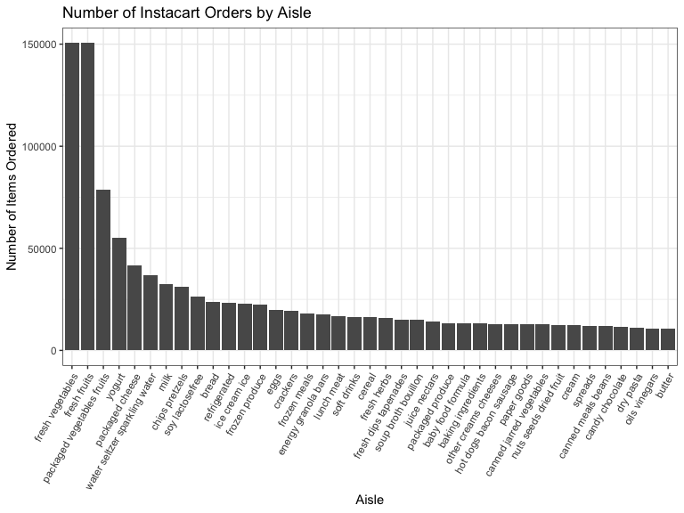

P8105 - Homework 3
================
Molly Martorella
10/12/2019

# Problem 1

The Instacart data from 2017 has **1384617** orders, and it describes
these orders with **15** variables, some of which are: *order\_id*,
*product\_id*, *product\_name*, whether it was *reordered*, and the
*department\_id* and *aisle*. There are 134 aisles, and the fresh
vegetable and fresh fruit aisles are ordered from the most.

## Plot of Most Popular Aisles

``` r
instacart %>% 
  count(aisle, sort = TRUE) %>% 
  filter(n > 10000) %>% 
  ggplot(aes(x = reorder(aisle, -n), y = n)) +
  geom_col() +
  ggtitle("Number of Instacart Orders by Aisle") +
  xlab("Aisle") +
  ylab("Number of Items Ordered") +
  theme(axis.text.x = element_text(angle = 60, 
                                   hjust = 1))
```



## Three most popular items from select aisles

The number of times the three most popular items in each of the aisles
“baking ingredients”, “dog food care”, and “packaged vegetables
fruits” are ordered is presented in the following table:

``` r
instacart %>% 
  filter(aisle %in% c("baking ingredients", 
                    "dog food care", 
                    "packaged vegetables fruits")) %>% 
  group_by(aisle) %>% 
  count(product_name, sort = TRUE) %>% 
  filter(min_rank(desc(n)) <= 3) %>% 
  pivot_wider(names_from = aisle,
              values_from = n) %>% 
  knitr::kable()
```

| product\_name                                 | packaged vegetables fruits | baking ingredients | dog food care |
| :-------------------------------------------- | -------------------------: | -----------------: | ------------: |
| Organic Baby Spinach                          |                       9784 |                    |               |
| Organic Raspberries                           |                       5546 |                    |               |
| Organic Blueberries                           |                       4966 |                    |               |
| Light Brown Sugar                             |                            |                499 |               |
| Pure Baking Soda                              |                            |                387 |               |
| Cane Sugar                                    |                            |                336 |               |
| Snack Sticks Chicken & Rice Recipe Dog Treats |                            |                    |            30 |
| Organix Chicken & Brown Rice Recipe           |                            |                    |            28 |
| Small Dog Biscuits                            |                            |                    |            26 |

## Ordering Day/Time of Pink Lady Apples vs Coffee Ice Cream

The following is a table showing the mean hour of the day per each day
of the week that Pink Lady Apples and Coffee Ice Cream are ordered.

``` r
instacart %>% 
  filter(product_name %in% c("Pink Lady Apples",
                           "Coffee Ice Cream")) %>% 
  group_by(product_name, order_dow) %>% 
  mutate(mean_hour = mean(order_hour_of_day)) %>% 
  select(c(product_name, 
           order_dow, 
           mean_hour)) %>%
  distinct() %>% 
  pivot_wider(names_from = order_dow, 
              values_from = mean_hour) %>% 
  rename(Monday = '0',
         Tuesday = '1',
         Wednesday = '2',
         Thursday = '3',
         Friday = '4',
         Saturday = '5',
         Sunday = '6') %>%
  select(product_name, 
         Monday, 
         Tuesday, 
         Wednesday, 
         Thursday, 
         Friday, 
         Saturday, 
         Sunday) %>% 
  knitr::kable(digits = 1)
```

| product\_name    | Monday | Tuesday | Wednesday | Thursday | Friday | Saturday | Sunday |
| :--------------- | -----: | ------: | --------: | -------: | -----: | -------: | -----: |
| Pink Lady Apples |   13.4 |    11.4 |      11.7 |     14.2 |   11.6 |     12.8 |   11.9 |
| Coffee Ice Cream |   13.8 |    14.3 |      15.4 |     15.3 |   15.2 |     12.3 |   13.8 |
